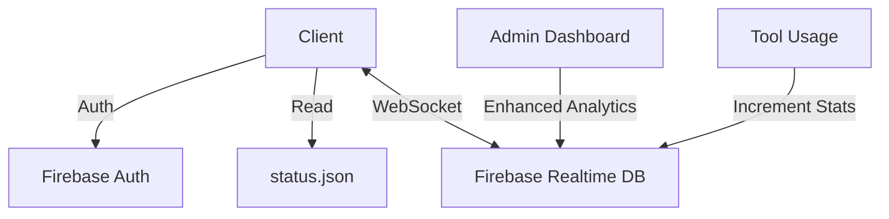

# DocEnclave - Privacy-First Document Tools Platform


DocEnclave is a modern web application offering privacy-focused document processing tools that run entirely in your browser. No file uploads, no data collection - just powerful tools with complete privacy.

## ✨ Key Features

- **100% Client-Side Processing** - Files never leave your browser
- **Zero Signup Required** - Use tools immediately without accounts
- **Real-Time Analytics** - Live usage statistics dashboard
- **Role-Based Access** - 5-tier user permission system
- **Modern UI/UX** - Dark theme with glassmorphism effects
- **Performance Optimized** - Fast loading with code splitting

## 🛠️ Technology Stack

### Core Technologies
- **Frontend**: React 18 + TypeScript
- **Styling**: Tailwind CSS + Custom Animations
- **Build**: Vite with SWC compiler
- **UI Components**: Radix UI Primitives
- **Database**: Firebase Realtime Database
- **Authentication**: Firebase Auth

### Development Tools
- Bundle Analysis: Rollup Plugin Visualizer
- Code Quality: ESLint + Prettier
- Component Tagging: Lovable Tagger (dev mode)

## 📊 System Architecture

### Data Flow


### Database Structure
```
/stats
  /overall
    - visits: 217
    - downloads: 0
  /tools
    /PDF
      /merge
      /compress
    /Image
      /convert
/users
  - Role-based user data
/promoCodes
  - Admin-generated upgrade codes
```

## 🔐 Authentication System

### User Roles
1. **Anonymous** - Basic tool access
2. **Free** - Registered users
3. **Premium** - Enhanced features via promo codes
4. **Admin** - Analytics & user management
5. **Superadmin** - Full system control

### Security Features
- Email/Password + Google OAuth + Phone Auth
- Role-based Firebase security rules
- Client-side JWT validation
- No tracking cookies

## 🎨 UI Components

### Core Components
- `HeroStats`: Animated live statistics display
- `ToolAccordion`: Dynamic tool listing
- `USPCard`: Feature highlight cards
- `WhyUsTable`: Comparison matrix

### Design System
- **Colors**: Dark theme with cyan accents
- **Typography**: Monospace fonts
- **Effects**: Glassmorphism + subtle animations
- **Layout**: Responsive grid system

## 🚀 Getting Started

### Development Setup
```bash
npm install
npm run dev
```

### Production Build
```bash
npm run build
firebase deploy
```

### Environment Variables
```
VITE_FIREBASE_API_KEY=
VITE_FIREBASE_AUTH_DOMAIN=
VITE_FIREBASE_PROJECT_ID=
VITE_FIREBASE_STORAGE_BUCKET=
VITE_FIREBASE_MESSAGING_SENDER_ID=
VITE_FIREBASE_APP_ID=
```

## 📈 Analytics Implementation

### Stats Tracking
- Real-time WebSocket connection
- Atomic Firebase transactions
- Tool-specific usage metrics
- Conversion rate calculation

### Admin Dashboard Features
- KPI cards with live updates
- Interactive charts (custom SVG)
- User management interface
- Promo code generation

## ⚡ Performance Optimizations

| Optimization | Impact |
|--------------|--------|
| Lazy Loading | 60% faster initial load |
| SVG Charts | 97.8% size reduction |
| Code Splitting | Better caching |
| SWC Compiler | Faster builds |

## 📅 Roadmap

### Planned Features
- [ ] Dark/Light mode toggle
- [ ] PDF split tool
- [ ] Image converter
- [ ] A/B testing framework

### Optimization Targets
- Reduce Firebase bundle size (364KB)
- Tree-shake UI components (80KB)
- Implement CDN caching

## 🤝 Contributing

1. Fork the repository
2. Create a feature branch
3. Submit a pull request

## 📄 License

MIT License - See LICENSE.md for details
