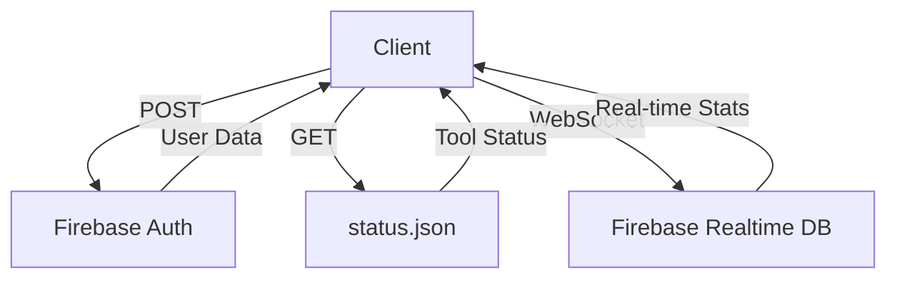

# Tool Management System Infrastructure

## 1. Frontend Architecture
- **Framework**: React with TypeScript
- **Build System**: Vite
- **Styling**: Tailwind CSS with custom dark theme
- **Component Library**: Custom UI components (Card, Select, Charts etc.)
- **State Management**: React hooks + Firebase realtime updates

## 2. Backend Services
- **Database**: Firebase Realtime Database
- **Authentication**: Firebase Auth (email/password, Google, phone)
- **Hosting**: Firebase Hosting (for static assets)

## 3. Data Flow


## 4. Key Components

### 4.1 Tool Status System
- Defined in `public/tools/status.json`
- Hierarchical structure: Category → Tool → Status
- Status values: "available" | "coming_soon"
- Example:
```json
{
  "PDF": {
    "merge": "available",
    "split": "coming_soon"
  }
}
```

### 4.2 Analytics System
- **Data Collection**:
  - Tracks visits, downloads, and custom events
  - Time-based tracking (daily/weekly/monthly)
- **Data Processing**:
  - `useLiveStatsEnhanced` hook combines static + dynamic data
  - Calculates metrics like conversion rates
- **Storage**:
  - Firebase Realtime Database structure:
    ```
    /stats
      /overall
      /tools/{category}/{tool}
      /timeBased/{period}
    ```

### 4.3 Admin Dashboard
- **Components**:
  - ToolDetailTab: Drill-down analytics
  - AnalyticsTab: Overview metrics
  - UsersTab: User management
  - PromoCodesTab: Promo code system
- **Visualization**:
  - Recharts for data visualization
  - Responsive layouts for all devices

## 5. Security
- Firebase Security Rules for data access control
- Role-based authentication (free/premium/admin)
- Client-side processing for privacy (no server uploads)

## 6. Deployment
- Static assets served via Firebase Hosting
- CI/CD integration possible via Firebase CLI
- Environment configuration in firebase.json
